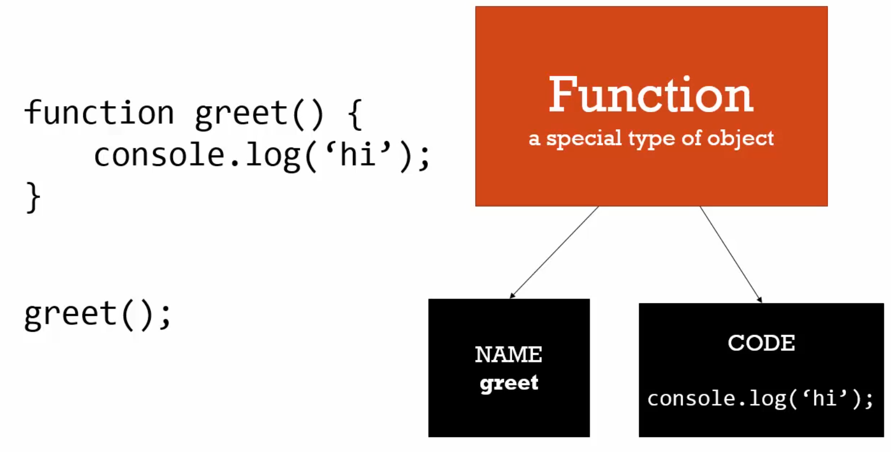
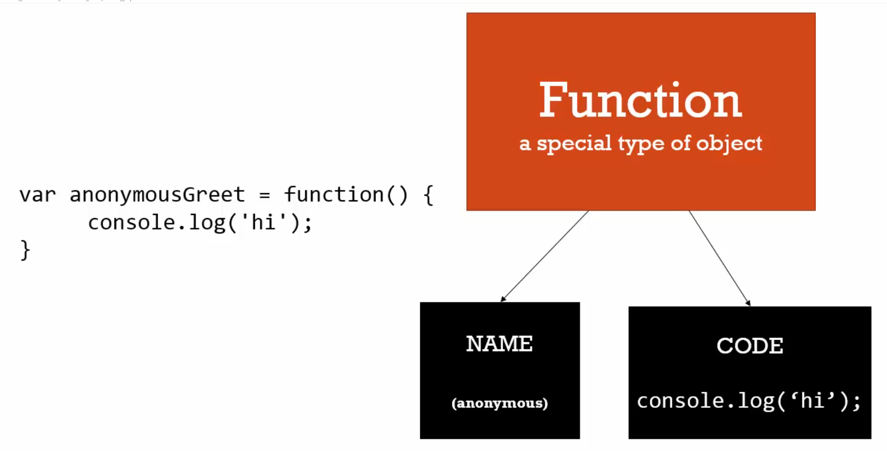
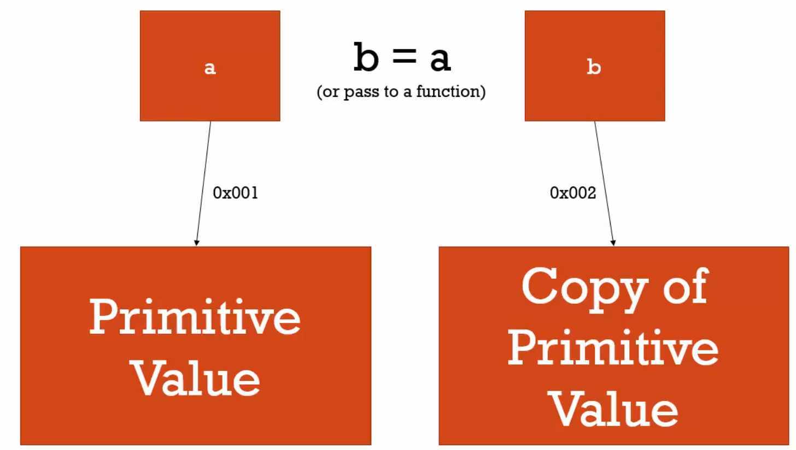
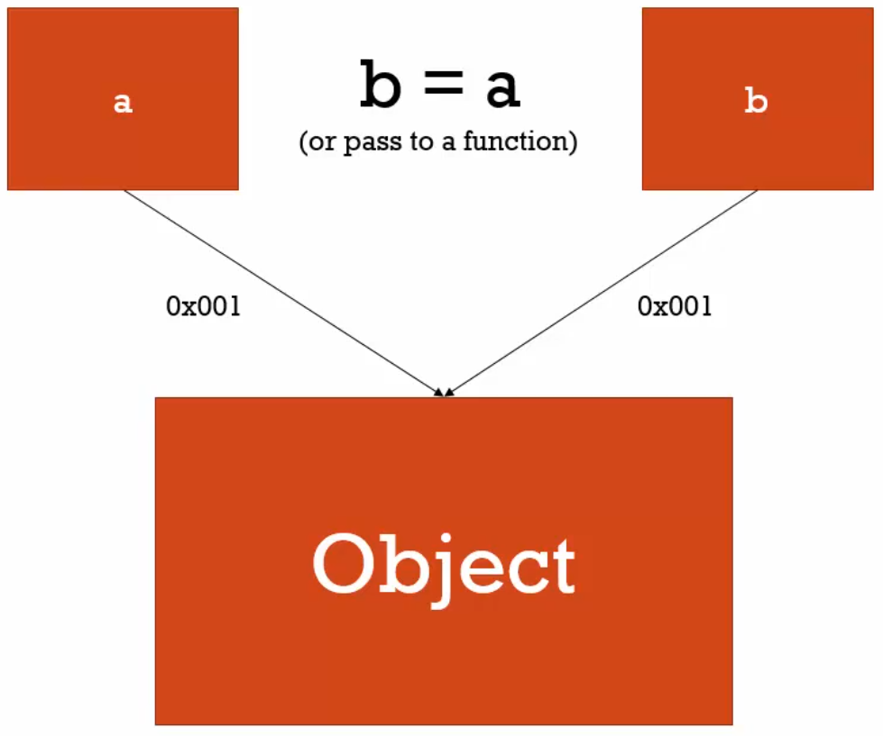

# Objects và Functions

Object và Function có liên quan mật thiết với nhau

# Object và Dot

Object có thể chứa `Primitive "property"` và có thể có `Object "property"` và có thể chứa `Function gọi là "method"`. Tất cả các Object đều nằm trong bộ nhớ máy tính.

```javascript
var person = new Object();

person["lastname"] = "Thao"; // truy cập vào Object và gán giá trị. Nếu không có property lastname thì sẽ tạo ra. Hoặc
person.firstname = "Y"; // cách này tương tự như cách trên nhưng dễ đọc hơn.

var firstNameProperty = "firstname";

console.log(person[firstNameProperty]);

person.address = new Object(); // Trong object person ta tạo thêm object mới là address
person.address.street = "111 Main St."; // thứ tự toán tử . là từ trái qua phải. Vì vậy nó sẽ tìm address trong bộ nhớ và sau đó truy cập thêm.
```

# Objects và Object Literals ({})

Cách để tạo Object một cách đơn giản hơn và dễ đọc hơn là:

```javascript
var person = {};
person.firstname = "Thao";
person.lastname = "Y";
```

Hoặc

```javascript
var person = { firstname: "Thao", lastname: "Y" };
```

Từ đó chúng ta có thể mở rộng hơn. Chúng ta có thể thêm property cho object như dưới đây:

```javascript
person.address = {
  street: "111 Main St",
  city: "New York",
};
```

# Framework Aside Faking Namespaces

Namespace: là một container chứa biến và hàm. Thông thường người ta sẽ giữ những hàm và biến có cùng tên tách biệt nhau. Hãy xem ví dụ dưới:

```javascript
var english = {
  greetings: {
    basic: "Hello",
  },
};

var spanish = {
  greetings: {
    basic: "Hola",
  },
};
```

Cả english và spanish đều có các property giống nhau nhưng giá trị khác nhau. Đây là đặc điểm chủ yếu của namespace.

# JSON và Object Literals

Lý do người ta tạo ra JSON (JavaScipt Object Notation):

- Khi chưa có JSON người ta truyền dữ liệu từ server xuống client bằng XML nhưng XML lại tốn quá nhiều băng thông.
- Khi người ta thấy Object của JS rất tốt vì thế người ta đã sinh ra JSON để giải quyết vấn đề của XML.

Tất cả các JSON đều ra Object trong JS nhưng không phải tất cả các Object trong JS đều là JSON. Xem ví dụ dưới đây:

```javascript
var objectLiteral = {
  firstname: "Thao",
  isProgramer: true,
};

var jsonValue = {
  firstname: "Thao",
  isProgramer: true,
};
```

JSON trong phần key phải được bọc vào trong `"`. Và trong JS có JSON Object có 2 hàm đó là: `JSON.stringify(Object)` chuyển Object thành string và `JSON.parse(String)` chuyển String thành Object.

# Functions là Objects

First Class Function: trong JS Function là Object. First Class Function có nghĩa là tất cả những gì chúng ta làm được với các kiểu dữ liệu khác chúng ta có thể làm nó với Function. Ví dụ như gán một biến, truyền nó, tạo ra nó.

Function là một kiểu dữ liệu đặc biệt của Object

- Gán Primitive
- Gán Object
- Gán nó một hàm.
- Một trong 2 property bị giấu đó là Name (Tên) có thể Function không có Name gọi là anonymous
- Một Property khác là Code (những dòng code ta viết) và có Property này đặc biệt có thể chạy được (()).

```javascript
function greet() {
  console.log("Hi");
}

greet.language = "English";

console.log(greet.language); // English
```

Khi chúng ta tạo hàm greet, hàm greet này sẽ nằm trong bộ nhớ. Trong trường hợp này nó nằm ở Global Object. Có Property Name là greet, Property Code `console.log('Hi')`. Chúng ta nên suy nghĩ Function như một Container chứa code.

# Function Statements và Function Expressions

Expression: là một đoạn code dẫn đến một giá trị. Nó không cần phải lưu biến.

```javascript
a = 3; // trả về giá trị 3
1 + 2; // trả về 3 nhưng không lưu nó vào
```

Giá trị có thể là Number, String, Object, ...Đây là ví dụ về Expression

Statement: không có trả về giá trị ví dụ như if

```javascript
var a;
if (a === 3) {
}
```

If là statement và bên trong lệnh If đó là Expression

Một ví dụ khác:

```javascript
function greet() {
  console.log("hi");
}
```

Hàm greet chỉ là một Statements vì khi chạy không có một giá trị gì trả về. Và khi JS Engine thấy nó sẽ bỏ nó vào bộ nhớ và được hoisted trong Createtion Phase ở Execution Context vì vậy có thể sử dụng trươc khi nó được định nghĩa.

```javascript
var anonymousGreet = function () {
  console.log("hi");
};
```

Nhìn chúng có vẻ giống nhau nhưng thực chất là khác nhau. Ví dụ dưới này là Function Expression. Vì sao? Lý do nó trả về giá trị, trong JS Function cũng là một object, và ở đây là anonymous function (không có tên) và sau khi khởi tạo nó trả về kết quả là object và gán vào biến anonymousGreet. Vì vậy ở đây đã trả về kết quả nên nó là Function Expression. Cách gọi nó cũng y như trên đó là `anonymousGreet()`.


Cách khởi tạo hàm trên


Cách khởi tạo hàm dưới

```javascript
anonymousGreet(); // sẽ không chạy vì biến này chỉ mới khởi tạo giá trị và không gán => Lỗi undefined is not a function

var anonymousGreet = function () {
  console.log("hi");
};

anonymousGreet(); // hi
```

Một ví dụ khác

```javascript
function log(a) {
  console.log(a);
}

log(3); // 3
log("Hi"); // Hi
log({ num: 3 }); // Object { num: 3 }
log(function () {
  console.log("a");
}); // Object function

function log(a) {
  a(); // Đây là cách chạy khi chúng ta truyền function vào tham số
}
```

# BY VALUE VÀ BY REFENRCE

Ví dụ về BY VALUE

Ta có một biến a là kiểu Primitive Value. Khi biến a khởi tạo và có giá trị nó sẽ có một địa chỉ trong bộ nhớ. Và chúng ta có thể `b = a` hoặc truyền a vào hàm b `b(a)`. Nếu nó là kiểu Primitive Value trong JS thì b sẽ copy giá trị của a và được tạo ra một địa chỉ mới. Đây được gọi là BY VALUE.



Ví dụ về BY REFENRCE

Tương tự như trên nhưng nó là Object thì sẽ khác


Cả 2 biến đều là Object đều trỏ cùng một địa chỉ.

```javascript
// BY VALUE
var a = 3;
var b;

b = a;
a = 2;

console.log(a); // 2
console.log(b); // 3, BY VALUE, đã copy giá trị và có địa chỉ khác với biến a
```

# Mutate

Nó có thể thay đổi một thứ gì đó, "immutate nó không thể thay đổi"

```javascript
// BY REFENRCE
var c = { greeting: "hi" };
var d;

d = c;
c.greeting = "hola"; // Mutate Object

console.log(c); // { greeting: "hola" }
console.log(d); // { greeting: "hola" }

// BY REFENRCE ngay cả khi là tham số
function changeGreeting(obj) {
  obj.greeting = "salu";
}

changeGreeting(d);

console.log(c); // { greeting: "salu" }
console.log(d); // { greeting: "salu" }

c = { greeting: "howdy" }; // toán tử  = đã tạo một địa chỉ mới cho c
console.log(c); // { greeting: "howdy" }
console.log(d); // { greeting: "salu" }
```
