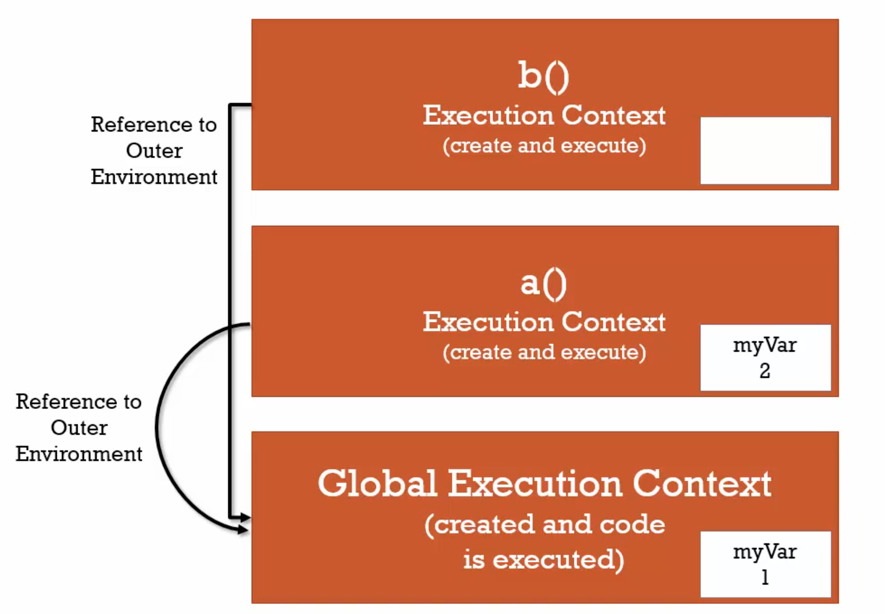
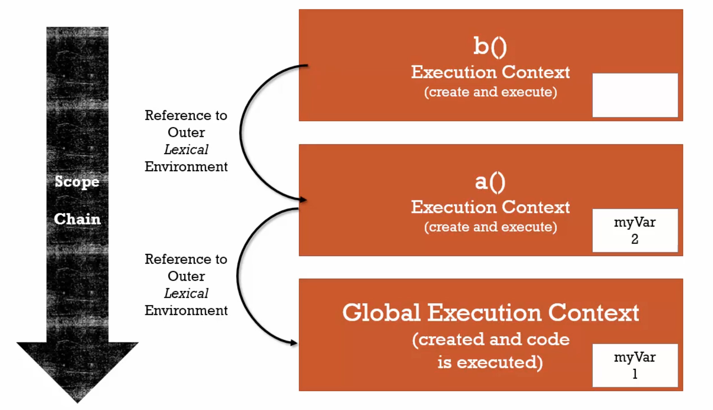

# Syntax Parser:

Là một chương trình đọc code của chúng ta và tìm hiểu nó có nghĩ gì và cấu trúc có đúng hay không. Khi chúng ta viết code JS thì có một chương trình khác đọc code của chúng ta và viết lại theo cách mà máy tính hiểu và thực thi code của chúng ta.

Ví dụ như chúng ta viết code thì có một chương trình sẽ compile nó qua chương trình mà máy tính hiểu. Điều quan trọng là trong quá trình nó viết lại cho máy tính hiểu nó có thể là thêm một số điều khác nữa.

# Lexical environment

Là nơi một cái gì đó nằm thực tế trong code của chúng ta viết.

Lexical có nghĩa là chúng ta nên làm gì với những đoạn code này.

```javascript
function hello() {
  var a = "hello world";
}
```

Ví dụ đoạn mã này viết ở đầu chương trình và cái biến a năm trong hàm hello. Nhưng thứ trên ta gọi là Lexical Env.

# Execution Context

Là một trình bao bọc để giúp quản lý mã đang chạy.
Có rất nhiều Lexical Env. Vì vậy khi chúng chạy chúng phải được quản lý bởi Execution Context. Nó có thể chứa nhiều thứ ngoài những gì bạn đã viết trong code của chúng ta.

# Name / Value Pairs

Là một cái tên gắn với một giá trị duy nhất. Tên có thể định nghĩa nhiều lần nhưng chỉ có 1 giá trị duy nhất khi thực thi. Giá trí có thể có nhiều Name / Value Pairs.

```
Address = '100 Main St.'
```

Address ở đây là Name, 100 Main St. là value.

# Object

Là một tổ hợp của Name / Values Pair.

```javascript
address: {
  Street: 'Main',
  Apartment: {
    Floor: 3,
    Number: 301
  }
}
```

Ví dụ value của Name address là một object. Value của Apartment cũng là một object. Nên suy nghĩ đơn giản về JS đừng phức tạp hóa.

# Global Environment, Global Object

Khi chúng ta thực thi mã JS thì mã của chúng ta thực thị trong Execution Context (còn gọi là Global Execution Context). Khi chúng ta nói Global là chúng ta có thể truy cập nó bất kỳ đâu trong mã của chúng ta, hay đơn giản hơn nó không nằm trong hàm.

Khi JS thực thi ở trình duyệt trong Execution Context (Global) thì sẽ tạo ra 2 thứ đó là: `Global Object` và biến đặt biệt `this`. Nếu mã JS không có dòng code nào nó vẫn sẽ tạo ra 2 thằng trên. Ví dụ khi không có mã gì trong JS thì trình duyệt sẽ tạo ra Object là window và `this` cũng là window (đang nói trong môi trường trình duyệt).

```javascript
var a =  'Hello';

function b {

}
```

Khi mã của chúng ta như trên thì cả a và b đều là global (vì chúng không nằm trong hàm). Khi đó Global Object là window sẽ có Name / Value Pairs là a và b. Khi đó ta có thể truy cập a bằng cách `a` hoặc `window.a` hoặc `this.a`

Thực chất chúng ta còn thêm một thứ được tạo ra nữa là Outer Enviroment (nhưng trong trường hợp global này thì nó sẽ không có vì mọi thứ đều global)

Sau đó là đoạn mã của chúng ta.


# Creation và Hoisting

Nhìn vào đoạn code dưới đây:

```javascript
var a = "Hello";

function b() {
  console.log("Called b");
}

b();
console.log(a);
```

Kết quả đoạn code trên khi thực thi là:

Called b <br>
Hello

Đúng như chúng ta dự tính.

Nhưng nếu đoạn code dưới đây thì sao:

```javascript
b();
console.log(a);

var a = "Hello";

function b() {
  console.log("Called b");
}
```

Chúng ta có thể nghĩ là kết quả là lỗi nhưng thực chất là kết quả dưới đây:

Called b <br>
undefined

Vấn đề như trên trong Javascript gọi là Hoisting

Như chúng ta biết thì khi thực thi code thì Execution Context sẽ có 2 phase: CREATION PHASE

Trong CREATION PHASE sẽ làm những thứ dưới:
Global Object <br>
this <br>
Outer Enviroment
Và giai đoạn quan trọng nhất là chuẩn bị bộ nhớ cho Variables (biến) và Functions (Hàm) gọi là "Hoisting".

Một vấn đề nữa là giai đoạn này mới chuẩn bị bộ nhớ chứ chưa thực thi code (đối với function nó sẽ lưu hết nhưng đối với toán tử như gán thì phải chờ giai đoạn hai gọi là thực thi). Vì vậy giá trị của a là undefined vì giá trị của a chưa được gán khi chạy console.log(a);

# JAVASCRIPT VÀ UNDEFINED

Khi chúng ta khai báo một biến mà chưa gán giá trị thì giá trị của nó sẽ là undefined. Đây là giá trị đặc biệt trong Javascript.

```javascript
var a;
console.log(a); // undefined

if (a === undefined) {
  console.log("a is undefined");
}
```

Biểu thức trên là đúng và sẽ output ra: 'a is undefined'

# EXECUTION CONTEXT PHASE 2 CODE EXECUTION

Phase 2 của Execution Context đó là Code Execution. Khi chúng ta đã qua Phase 1 đó là Creation Phase. Javascript đã set bộ nhớ cho biến và hàm. Qua Phase 2 nó chỉ đơn giản là chạy code theo từng dòng.

```javascript
function b() {
  console.log('Called b!');
}

b();

console.log(a);

var = 'Hello';

console.log(a);
```

Theo như chúng ta đã học thì Output ra sẽ là:
Called b<br>
undefined<br>
Hello

# Single Threaded

Chỉ thực thi một lệnh mỗi lần. Đó là theo lý thuyết về lập trình của chúng ta. Nhưng đối với Browser có thể không.

# Synchronous Execution

Cũng thực thi mỗi lần một dòng code. Và theo trình tự.

# Function Invocation

Invocation: còn gọi là gọi hàm, chúng ta gọi làm bằng dấu ngoặc ().

```javascript
function b() {}

function a() {
  b();
}

a();
```

Cách hoạt động của đoạn code trên la:

- Tạo ra Global Execution Context (creation phase and execution phase). Sau khi tạo ra môi trường rồi thị chạy từng dòng code đến đoạn a() thì JS biết đây là lời gọi hàm thì nó sẽ chạy hàm a.
- Khi hàm a chạy hoặc khi lời gọi hàm bất kỳ trong JS nó sẽ tạo ra một Execution Context khác và xếp Execution Context a lên trên Global Execution Context. Xếp như vậy giống như stack và đựoc gọi là Execution Stack. Execution nào mà đang ở trên cùng có nghĩa là nó đang chạy. Và trong hàm a lại có lời gọi hàm b, nó sẽ tạo tiếp Execution Context của b và chạy nó. Và thực tế thứ tự của hàm trong JS không quan trọng. Và sau khi b chạy xong b sẽ bị pop ra. Và hàm a, a chạy xong pop a và còn lại Global Context.

# Function, Context và Variable Enviroment

Variable Enviroment: có nghĩa là biến có phạm vị nằm ở đâu. Và nằm ở đâu trong bộ nhớ.

```javascript
function b() {
  var myVar;
  console.log(myVar); // undefined
}

function a() {
  var myVar = 2;
  console.log(myVar); // 2
  b();
}

var myVar = 1;
console.log(myVar); // 1
a();
console.log(myVar); // 1
```

Lý dó có những kết quả trên là vì: khi chúng ta chạy hàm, mỗi hàm trong JS nó sẽ tạo ra một Execution Context và cái biến trong hàm đó thuộc về Execution Context của nó. Và biến myVar ở ngoài là thuộc Global Exectution Context nên kết quả luôn luôn là 1.

# Scope Chain

```javascript
function b() {
  console.log(myVar);
}

function a() {
  var myVar = 2;
  b();
}

var myVar = 1;
a();
```

Chúng ta nghĩ output ra là gì? Có thể là 1 hoặc 2 hoặc undefined. Thực chất output ra sẽ là 1 vì những lý do sau:

- Khi code chạy sẽ tạo ra Global Execution Context. Khởi tạo bộ nhớ cho hàm và biến. Sau đó chạy từng dòng code đến đoạn hàm a được gọi thì.
- Sẽ tạo ra tiếp Execution Context của hàm a. Hàm a cũng sẽ khởi tạo bộ nhớ cho biến myVar và thực thi code. Thi thực thi đến đoạn gọi hàm b thì
- Sẽ tạo ra tiếp Execution Context của hàm b. Hàm b cũng sẽ khởi động bộ nhớ và chạy code. Khi có dòng console.log(myVar). Hàm b sẽ tìm bên trong Execution Context của hàm b xem có chổ nào định nghĩa hay gán biến myVar hay không. Nếu không có thì nó sẽ ra ngoài và kiếm. Để biết lý dó tại sao nó ra ngoài kiếm vì trong quá trình tạo Execution Context có khởi tạo thêm Outer Context Enviroment và Outer ở đây là Global. Hay nói cách khác Lexical Enviroment của b là Global vì hàm b nằm ở Global.
- Sau khi nó ra Global và thấy ở Global có gán biến myVar = 1, nó sẽ lấy giá trị đó và output ra màn hình.

  

Đây là hình ảnh khái quát lại những gì xảy ra với đoạn code trên.

Những điều trên gọi là Scope chain. Có nghĩa là khi cần tìm biến hay hàm nó sẽ đi từ trên xuống dưới, từ trong ra ngoài.

```javascript
function a() {
  function b() {
    console.log(myVar);
  }

  var myVar = 2;
  b();
}

var myVar = 1;
a();
```

Nhưng đối với đoạn code này Scope Chain sẽ khác. Vì hàm b lexical của nó là nằm trong hàm a cho nên nó sẽ phải ra hàm a kiếm trước nếu không có mới ra global.


# Scope, ES6 và let

Scope: có nghĩa là nơi biến nằm ở đâu trong code của chúng ta. Ví dụ khi ta gọi 1 hàm 2 lần nhưng 2 lần thực thi hàm là 2 execution context khác nhau.

Khi ES6 ra mắt ở năm 2015, đã ra mắt thêm một từ khoá let. Khi chúng ta khai báo biên bằng let nếu mà thứ tự từ khai báo không nằm đúng trình tự thì sẽ báo lỗi mặc dù biến đã nằm trong bộ nhớ. Chúng ta không thể sử dụng nó trừ khi dòng code khai báo let đã chạy.

Và khi khai báo biến bằng từ khoá let ở trong block thì biến sẽ tồn tại trong block đó khi block đó được thực thi.

# Asynchronous Callback

Bản thân Javascript Engine ở các phiên bản trước khi V8 ra mắt thì chỉ có Synchronous. Có nghĩa là chỉ xử lý một tác vụ 1 lần. Còn vấn đề Asynchronous nó sẽ nằm ở những API khác. Ví dụ ở Browser sẽ có những API như Web API, HTTP API, Render API, .... Vì vậy việc xử lý bất đồng bộ đó là nhớ những API này (nằm ngoài Javascript Engine). Và vấn đề để xử lý những thứ bất đồng bộ này là nhờ vào Event Queue. Khi một đoạn code bất đồng bộ thực thi nó sẽ nằm trong Event Queue theo thứ tự First Come First Serve. Và khi Execution Stack nó trống thì Event Queue này sẽ quăng đoạn code đó vào Execution Stack và thực thi nó.
