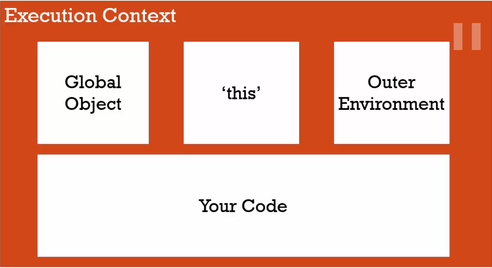

# Syntax Parser:

Là một chương trình đọc code của chúng ta và tìm hiểu nó có nghĩ gì và cấu trúc có đúng hay không. Khi chúng ta viết code JS thì có một chương trình khác đọc code của chúng ta và viết lại theo cách mà máy tính hiểu và thực thi code của chúng ta.

Ví dụ như chúng ta viết code thì có một chương trình sẽ compile nó qua chương trình mà máy tính hiểu. Điều quan trọng là trong quá trình nó viết lại cho máy tính hiểu nó có thể là thêm một số điều khác nữa.

# Lexical environment

Là nơi một cái gì đó nằm thực tế trong code của chúng ta viết.

Lexical có nghĩa là chúng ta nên làm gì với những đoạn code này.

```javascript
function hello() {
  var a = "hello world";
}
```

Ví dụ đoạn mã này viết ở đầu chương trình và cái biến a năm trong hàm hello. Nhưng thứ trên ta gọi là Lexical Env.

# Execution Context

Là một trình bao bọc để giúp quản lý mã đang chạy.
Có rất nhiều Lexical Env. Vì vậy khi chúng chạy chúng phải được quản lý bởi Execution Context. Nó có thể chứa nhiều thứ ngoài những gì bạn đã viết trong code của chúng ta.

# Name / Value Pairs

Là một cái tên gắn với một giá trị duy nhất. Tên có thể định nghĩa nhiều lần nhưng chỉ có 1 giá trị duy nhất khi thực thi. Giá trí có thể có nhiều Name / Value Pairs.

```
Address = '100 Main St.'
```

Address ở đây là Name, 100 Main St. là value.

# Object

Là một tổ hợp của Name / Values Pair.

```javascript
address: {
  Street: 'Main',
  Apartment: {
    Floor: 3,
    Number: 301
  }
}
```

Ví dụ value của Name address là một object. Value của Apartment cũng là một object. Nên suy nghĩ đơn giản về JS đừng phức tạp hóa.

# Global Environment, Global Object

Khi chúng ta thực thi mã JS thì mã của chúng ta thực thị trong Execution Context (còn gọi là Global Execution Context). Khi chúng ta nói Global là chúng ta có thể truy cập nó bất kỳ đâu trong mã của chúng ta, hay đơn giản hơn nó không nằm trong hàm.

Khi JS thực thi ở trình duyệt trong Execution Context (Global) thì sẽ tạo ra 2 thứ đó là: `Global Object` và biến đặt biệt `this`. Nếu mã JS không có dòng code nào nó vẫn sẽ tạo ra 2 thằng trên. Ví dụ khi không có mã gì trong JS thì trình duyệt sẽ tạo ra Object là window và `this` cũng là window (đang nói trong môi trường trình duyệt).

```javascript
var a =  'Hello';

function b {

}
```

Khi mã của chúng ta như trên thì cả a và b đều là global (vì chúng không nằm trong hàm). Khi đó Global Object là window sẽ có Name / Value Pairs là a và b. Khi đó ta có thể truy cập a bằng cách `a` hoặc `window.a` hoặc `this.a`

Thực chất chúng ta còn thêm một thứ được tạo ra nữa là Outer Enviroment (nhưng trong trường hợp global này thì nó sẽ không có vì mọi thứ đều global)

Sau đó là đoạn mã của chúng ta.


