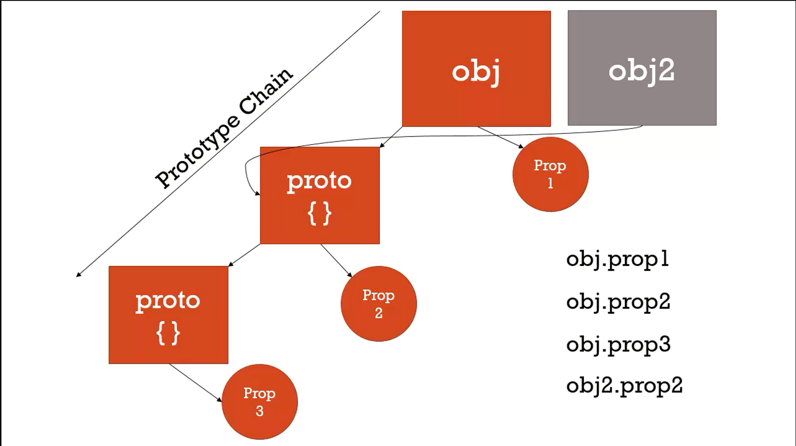

# Classical Inheritance

Inheritance: trong Javascript kế thừa của một object có nghĩa là có thể truy cập vào được đối tượng và phương thức của một object khác.

Classical Inheritance truyền thống chúng ta phải khó quản lý hơn cách mà Javascript quản lý. Với việc kế thừa của Javascript chúng ta có việc dễ mở rộng, linh hoạt và dễ hiểu.

Một số ví dụ về kế thừa:


```javascript
// Mỗi obj đều có thuộc tính là __proto__ nếu obj đó có kế thừa từ obj khác khi mà chúng ta truy cập thuộc tính hoặc phương thức của obj thì đầu tiên sẽ tìm trong obj đó, nếu obj đó không có thì sẽ đi tìm trong __pro__ của obj đó, nếu không có nữa sẽ tìm trong __proto__ của những obj mà nó kế thừa

var person = {
  firstname: "Default",
  lastname: "Default",
  getFullName: function () {
    return this.firstname + " " + this.lastname;
  },
};

var john = {
  firstname: "John",
  lastname: "Doe",
};

john.__proto__ = person;

console.log(john.getFullName()); // John Doe, this ở đây là john.
console.log(john.firstname); // John

var jane = {
  firstname: "Jane",
};

jane.__proto__ = person;
console.log(jane.getFullName()); // Jane Default
```

# Tất cả mọi thức trong Javascript đều là Object hoặc primitive

Hầu như tất cả trong Javascript đều là primitive như number, string, boolean, function, array, basic obj, ... Chúng đều có prototype nhưng ngoại trừ đó là base obj trong JS.

```javascript
var a = {};
var b = function () {};
var c = [];

a.__proto__; // là obj cơ bản nhất
b.__proto__; // cũng là obj cơ bản của hàm
c.__proto__; // cũng là prototype của array
```

Nhờ tất cả những thứ này (kế thừa mặc định) mà chúng ta có thể sử dụng những phương thức của các đối tượng này.

# Reflection và Extend

Reflection: Một đối tượng có thể nhìn vào chính nó, liệt kê và thay đổi thuộc tính và phương thức của nó.

```javascript
var person = {
  firstname: "Default",
  lastname: "Default",
  getFullName: function () {
    return this.firstname + " " + this.lastname;
  },
};

var john = {
  firstname: "John",
  lastname: "Doe",
};

john.__proto__ = person;

// Duyệt ra các key của một đối tượng
for (var prop in john) {
  console.log(prop + ": " + john[prop]); // sẽ in ra tất cả key và value của object john và cả phương thức getFullName mà nó được kế thừa

  if (john.hasOwnProperty(prop)) {
    console.log(prop + ": " + john[prop]); // sẽ chỉ in ra key và value mà nó sỡ hữu
  }
}

var jane = {
  address: "111 Main St.",
  getFormalFullName: function () {
    return this.lastname + " " + this.firstname;
  },
};

var jim = {
  getFirstName: function () {
    return firstname;
  },
};

// Vì một lý do nào đó mà chúng ta không muốn kế thừa những thuộc tính và phương thức của chúng ta bằng prototype mà chúng ta muốn mở rộng obj thì chúng ta có thể sử dụng phương thức extend
_.extend(john, jane, jim); // lấy những thuộc tính và phương thức của obj `jane` và `jim` bỏ vào john (mở rộng john)
```

# Function Constructors, new keyword

Như chúng ta đã biết cách để tạo ra object đó là sử dụng {}. Và có nhiều cách khác để tạo ra object với việc kế thừa prototype.

```javascript
function Person(firstname, lastname) {
  console.log(this); // Person {} -> object rỗng thuộc kiểu Person
  this.firstname = firstname;
  this.lastname = lastname;
}

var john = new Person("John", "Doe");
console.log(john); // Person { firstname: 'John', lastname: 'Doe'}
```

Chú ý ở đây là từ khóa `new`, khi chúng ta sử dụng từ khóa `new` thì trước tiên nó sẽ tạo ra một object rỗng. Sau đó nó sẽ tạo ra thuộc tính, phương thức và prototype. Và trong lúc đó từ khóa `new` cũng sẽ thiết lập lại `this`. Trong trường hợp này `this` là object `john`.

Nhưng đặc biệt của từ khóa `new` là nó có thể trả về giá trị nếu trong object có `return`.

```javascript
function Person(firstname, lastname) {
  this.firstname = firstname;
  this.lastname = lastname;

  return { greeting: "Hi" };
}

var john = new Person("John", "Doe");
console.log(john); // { greeting: "Hi" } -> vì có return trong Person
```

Còn nếu không có `return` thì sẽ trả về `this` sau khi đã thiết lập thuộc tính và phương thức (nếu có).

Và chúng ta gọi hàm Person là Function Constructor vì hàm này để xây dựng Object.

Function Constructor: là một function bình thường nhưng sử dụng để constructor object. Biến `this` sẽ trỏ đến một object rỗng và object này sẽ tự động trả về một cách tự động.

# Function Constructor và prototype

```javascript
function Person(firstname, lastname) {
  this.firstname = firstname;
  this.lastname = lastname;
}

var john = new Person("John", "Doe");
console.log(john.__proto__); // Person {} -> proto là một empty object
```

Chúng ta đã có thể biết cách khởi tạo function constructor nhưng còn về khởi tạo prototype thì làm sao? Có một tin tốt là khi chúng ta sử dụng function constructor thì nó đã khởi tạo prototype cho chúng ta.

Nên nhớ là Function là một Object đặc biệt. Trong Function có những Props sau mà chúng ta không để ý:

- Name
- Code (có thể thực thi khi gọi)
- Và tất cả những hàm chúng ta viết đều có prototype (chỉ được sử dụng khi sử dụng toán tử `new`). Cái này khác với **proto** để truy cập vào prototype (prototype này không phải của Function mà là prototype của Object)

```javascript
function Person(firstname, lastname) {
  this.firstname = firstname;
  this.lastname = lastname;
}

Person.prototype.getFullName = function () {
  return this.firstname + " " + this.lastname;
};

var john = new Person("John", "Doe");
console.log(john.getFullName()); // John Doe
```

Tất cả các Obj được khởi tạo từ Function Constructor Person đều có thể truy cập vào phương thức `getFullName`

Nhưng nhìn đoạn code dưới đây khác gì với ở trên

```javascript
function Person(firstname, lastname) {
  this.firstname = firstname;
  this.lastname = lastname;
  this.getFullName = function () {
    return this.firstname + " " + this.lastname;
  };
}

var john = new Person("John", "Doe");
console.log(john.getFullName()); // John Doe
```

Kết quả thì giống nhau nhưng thực chất là đoạn code dưới sẽ tốn nhiều tài nguyên hơn vì khi chúng ta sử dụng toán tử `new` sẽ tạo một instance mới. Và khi một instance mới thì sẽ chiếm bộ nhớ. Nhưng khi chúng ta khai báo prototype thì chỉ chiếm bộ nhớ 1 lần nhưng tất cả các instance đều có thể sử dụng nó.

Và sau này nếu chúng ta muốn mở rộng code thì chỉ việc thêm thuộc tính hoặc phương thức thì tất cả các instance đều có thể truy cập được.

# new keyword

```javascript
function Person(firstname, lastname) {
  this.firstname = firstname;
  this.lastname = lastname;
  this.getFullName = function () {
    return this.firstname + " " + this.lastname;
  };
}

var john = Person("John", "Doe");
```

Với đoạn code trên chúng ta nếu không có từ khóa `new` thì hàm vẫn sẽ là một hàm chứ nó không thực thi, và hàm này không có `return` nên giá trị của `john` là `undefined`. Vì vậy john sẽ không có thuộc tính và phương thức gì.

# Aside Built-In Function Constructor

```javascript
var a = new Number(3); // trả về là Object Number
var b = new String("Hi"); // trả về là Object String
```

Chú ý ở đây là nó trả về Object chứ không phải số hay chuỗi. Vì vậy nó kế thừa các thuộc tính và phương thức của đối tượng.

```javascript
String.prototype.isLengthGreaterThan = function (limit) {
  return this.length > limit;
};
```

Và tất cả các Object String đều có phương thức `isLengthGreaterThan`

Và chú ý đoạn code sau:

```javascript
var a = new Number(3);
var b = 3;

a == b; // true
a === b; // false
```

# Array và for ... in

```javascript
var arr = ["John", "Jane", "Jim"];

for (var prop in arr) {
  console.log(`${prop}: ${arr[prop]}`);
}
```

Hàm này hoạt động không lỗi lầm gì nhưng. Chú ý đoạn code dưới đây:

```javascript
Array.prototype.customFeature = "cool!";

var arr = ["John", "Jane", "Jim"];

for (var prop in arr) {
  console.log(`${prop}: ${arr[prop]}`);
}
```

Nếu như đoạn code trên thì kết quả mong muốn của chúng ta sẽ không còn như vậy nữa.

# Object.create và Pure Prototypal Inheritance

```javascript
var person = {
  firstname: "Default",
  lastname: "Default",
  greet: function () {
    return "Hi " + this.firstname;
  },
};

var john = Object.create(person); // Tạo ra một Object mới rỗng với prototype kế thừa từ person
john.firstname = "John";
john.lastname = "Doe";
console.log(john); // Hi John
```

Cả 2 lệnh gán thuộc tính này đều là giá trị của object john chứ không liên quan đến prototype person.

Và một số trình duyệt không hỗ trợ Object.create thì chúng ta sẽ sử dụng phương pháp đó là Polyfil. Ta sẽ hiện thực lại Object.create:

```javascript
Object.create = function (o) {
  if (arguments.length > 1) {
    throw new Error(
      "Object.create implementation only accepts the first parameter"
    );
  }

  function F() {}
  F.prototype = o;

  return new F();
};
```

# ES6 và Classes

Class là một template để khởi tạo object. Lợi ích của class là đóng gói data với code làm việc trên class đó.

## Khởi tạo class

Class thực chất là một dạng đặc biệt của function. Class nó 2 phần: class expressions và classd declarations.

Ví dụ khởi tạo class với `class declaration`

```javascript
class Rectangle {
  constructor(height, width) {
    this.height = height;
    this.width = width;
  }
}
```

## Hoisting

Điểm khác biệt giữa function declarations và class expressions là function có hoisting còn class thì không.

```javascript
const p = new Rectangle(); // ReferenceError

class Rectangle {}
```

## Class expressions

Phương thức khái báo class bằng function có thể có name hoặc không. Và chúng ta có thể truy cập thuộc tính nam của nó.

```javascript
// unnamed
let Rectangle = class {
  constructor(height, width) {
    this.height = height;
    this.width = width;
  }
};
console.log(Rectangle.name);
// output: "Rectangle"

// named
let Rectangle = class Rectangle2 {
  constructor(height, width) {
    this.height = height;
    this.width = width;
  }
};
console.log(Rectangle.name);
// output: "Rectangle2"
```

## Constructor

Là một phương thức đặc biệt của class. Nhằm mục đích khởi tạo và gán giá trị ban đầu của object.

Từ khóa `super` để gọi constructor của class super.

## Prototype Methods

```javascript
class Rectangle {
  constructor(height, width) {
    this.height = height;
    this.width = width;
  }
  // Getter
  get area() {
    return this.calcArea();
  }
  // Method
  calcArea() {
    return this.height * this.width;
  }
}

const square = new Rectangle(10, 10);

console.log(square.area); // 100
```

## Generator methods

```javascript
class Polygon {
  constructor(...sides) {
    this.sides = sides;
  }
  // Method
  *getSides() {
    for (const side of this.sides) {
      yield side;
    }
  }
}

const pentagon = new Polygon(1, 2, 3, 4, 5);

console.log([...pentagon.getSides()]); // [1,2,3,4,5]
```

## Static methods and properties

Những method hoặc properties static thì khi gọi chúng ta không cần một instance của class. Static phù hợp cho việc caches, config hoặc các data không khi thay thế khi khởi tạo instance

```javascript
class Point {
  constructor(x, y) {
    this.x = x;
    this.y = y;
  }

  static displayName = "Point";
  static distance(a, b) {
    const dx = a.x - b.x;
    const dy = a.y - b.y;

    return Math.hypot(dx, dy);
  }
}

const p1 = new Point(5, 5);
const p2 = new Point(10, 10);
p1.displayName; // undefined
p1.distance; // undefined
p2.displayName; // undefined
p2.distance; // undefined

console.log(Point.displayName); // "Point"
console.log(Point.distance(p1, p2)); // 7.0710678118654755
```

## Binding this với prototype và static method

```javascript
class Animal {
  speak() {
    return this;
  }
  static eat() {
    return this;
  }
}

let obj = new Animal();
obj.speak(); // the Animal object
let speak = obj.speak;
speak(); // undefined

Animal.eat(); // class Animal
let eat = Animal.eat;
eat(); // undefined
```

# Initialization

Trước khi viết code thì chúng ta nên khởi tạo hình dung các data hay object mà chúng ta sẽ làm việc với ứng dụng của chúng ta trước.

# typeof, instanceof

typeof: xác định kiểu của nó là gì

```javascript
var d = [];
Object.prototype.toString.call(d); // Object Array
```

instanceof: kiểm tra xem một instance có phải là một instance được khởi tạo từ object nào đó hay không.

# use strict

Những đoạn code chúng ta viết sẽ được chạy trong 'strict mode'

Trong 'strict mode' có những việc chúng ta sẽ không thể làm như:

- Sử dụng một biến chưa được khai báo.

```javascript
// Không được làm thế này
"use strict";
message = "Học lập trình JavaScript cơ bản";
document.write(message);
```

- Báo lỗi khi sử dụng delete

```javascript
"use strict";
// Khai báo biến rõ ràng với từ khóa
let message = "Học lập trình JavaScript cơ bản!";
// Sai vì không được delete
delete message;
```

- Các tham số của hàm không được trùng nhau

```javascript
"use strict";
// Sai vì tham số message bị trùng
function print_message(message, message) {
  document.write("Lập trình JavaScript căn bản");
}
```

- Không cho phép khai báo biến dưới dạng hệ nhị phân

```javascript
"use strict";
let number = 01010;
// Uncaught SyntaxError: Octal literals are not allowed in strict mode.
```

- Không đươc phép ghi đè lên thuộc tính chỉ đươc phép đọc

```javascript
"use strict";
let obj_demo = {};
Object.defineProperty(obj_demo, "ver", {
  value: 1,
  writable: false,
});
// Cố ghi đè lên thuộc tính chỉ đọc
obj_demo.ver = 10;
// Uncaught TypeError: Cannot assign to read only property 'ver' of object '#<Object>'
```

- Không được sử dụng with

```javascript
"use strict";
let one = 1;
let two = 2;
with (one) {
  document.write(one);
}
// Uncaught SyntaxError: Strict mode code may not include a with statement
```

- Không cho phép khai báo biến bên trong eval()

```javascript
"use strict";
eval("let x = 17");
document.write(x);
// Uncaught ReferenceError: x is not defined
```

- Không chấp nhận khai báo biến bằng tên keyword ở phiên bản cao hơn

Ở chế độ strict mode sẽ không cho phép bạn sử dụng các từ khóa sau để khai báo biến, hằng hay đặt tên cho hàm được sử dụng ở các phiên bản cao hơn (trong tương lai) như: implements, interface, let, package, private, protected, public, static và yield.

- Hành vi khác của từ khóa this

```javascript
"use strict";
function myFunction() {
  console.log(this); // Kêt quả: undefined
}
myFunction();
```

```javascript
function myFunction() {
  console.log(this); // Kêt quả: Window
}
myFunction();
```
